<h1 align="center">Лабораторна робота №5</h1>
<h3 align="center">Crack the PIN<br>Відновлення цифрового PIN за MD5 та дослідження меж повного перебору</h3>

<p align="center">
  <a href="https://github.com/RE22GDV/LR5-CrackPIN/actions/workflows/ci.yml"></a>
  
  
  
  
</p>

> Дисципліна: Захист даних · Тема: хеш-функції, пошук прообразу, повний перебір
> Задача: [Codewars — Crack the PIN](https://www.codewars.com/kata/5efae11e2d12df00331f91a6), 6 kyu

П’ятизначний PIN має лише 100 000 варіантів. Хеш довжиною 128 біт не збільшує цей простір.

---

## Зміст

1. [Мета та постановка задачі](#1-мета-та-постановка-задачі)
2. [Математична модель](#2-математична-модель)
3. [Структура репозиторію](#3-структура-репозиторію)
4. [Швидкий старт](#4-швидкий-старт)
5. [Верифікація рішення](#5-верифікація-рішення)
6. [Обчислювальні експерименти](#6-обчислювальні-експерименти)
7. [Криптоаналіз і межі практичності](#7-криптоаналіз-і-межі-практичності)
8. [Висновки](#8-висновки)
9. [Відтворення результатів](#9-відтворення-результатів)
10. [Список використаних джерел](#10-список-використаних-джерел)

---

## 1. Мета та постановка задачі

Мета роботи — відновити п’ятизначний цифровий PIN за його MD5-хешем,
реалізувати повний перебір і кількісно з’ясувати, від чого залежить його
практичність. Поглиблена частина порівнює довжину, алфавіт, позицію PIN,
вартість хешування, попередні обчислення, сіль і розподіл імовірностей. Додатково виконано реальні CPU-перебори шести алфавітів, масштабування до 16 процесів і перебір на GPU.

За умовою kata передається рядок із MD5-хешем PIN. Потрібно повернути
рядок із рівно п’яти цифр, зберігши провідні нулі. Перевіряються всі
кандидати від `00000` до `99999` включно. Знання самого PIN не надається.

| Величина | Значення |
|---|---|
| Вхід | MD5 у шістнадцятковому вигляді, 32 символи |
| Вихід | п’ятизначний PIN як рядок |
| Алфавіт | ASCII-цифри `0..9` |
| Пробний приклад | `827ccb0eea8a706c4c34a16891f84e7b` → `12345` |
| Приклад із нулями | `dcddb75469b4b4875094e14561e573d8` → `00000` |

Приклади в таблиці — локальні контрольні, не набір прихованих тестів
Codewars. Позаплатформна бібліотека додатково перевіряє формат входу,
підтримує довільну довжину 1–12 цифр, діапазон і ліміт спроб.

У формулюванні задачі є популярне спрощення: з хешу «неможливо визначити
пароль». Точніше, хеш не має загальної операції дешифрування, але обмежений
набір кандидатів можна перевірити прямим обчисленням. Хеші також не
гарантовано унікальні: різні повідомлення можуть мати однаковий результат.
Потрібно розрізняти прообраз заданого хешу та колізію двох повідомлень.
У цій роботі виконується саме пошук прообразу в малому просторі.

---

## 2. Математична модель

Нехай `P₍d₎` — множина всіх цифрових рядків довжини `d` із провідними
нулями, а `h` — заданий хеш. Шукаємо `p ∈ P₍d₎`, для якого `MD5(p) = h`.
MD5 обчислюється від байтів ASCII самого рядка: `00001` та `1` є різними
повідомленнями й мають різні хеші. Потужність простору та ентропію
за рівномірного вибору наведено у [формулі (1)](#formula-1).

<a id="formula-1"></a>

$$
N = |P_d| = 10^d,\qquad H_{\text{рівн}} = \log_2 N = d\log_2 10 \qquad\text{(1)}
$$

Для `d = 5`: `N = 100 000`, а ентропія за рівномірного вибору — лише
`16,61` біта. 128 біт у виході MD5 описують розмір множини можливих хешів,
а не кількість можливих PIN.

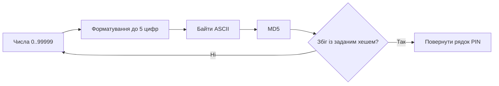

### Кількість спроб та час

За числового порядку перебору PIN зі значенням `k` потребує рівно `k + 1`
спроб. За рівномірного незалежного вибору PIN середню й максимальну
кількість перевірок визначено у [формулі (2)](#formula-2):

<a id="formula-2"></a>

$$
E[A] = \frac{N+1}{2},\qquad A_{\max}=N \qquad\text{(2)}
$$

За сталої швидкості `r` перевірок за секунду оцінки середнього
й максимального часу наведено у [формулі (3)](#formula-3):

<a id="formula-3"></a>

$$
E[T] = \frac{N+1}{2r},\qquad T_{\max}=\frac{N}{r} \qquad\text{(3)}
$$

Отже, для п’яти цифр точне математичне сподівання — `50 000,5` спроб,
а не буквально `50 000`. Останнє є зручним наближенням.

### Коректність алгоритму

На початку ітерації з номером `i` усі кандидати зі значенням меншим за `i`
вже перевірено. Формат `05d` однозначно переводить числа `0..99999` у
всі п’ятизначні рядки. Якщо хеш збігається, повернений рядок задовольняє
умову. Якщо цикл закінчується без збігу, у перевіреному просторі прообразу
немає. За наявності колізії алгоритм повернув би перший відповідний PIN;
перевірка всього простору показала, що серед цих 100 000 PIN колізій MD5 немає.

Для фіксованих п’яти цифр час — `O(10⁵)`, додаткова пам’ять — `O(1)`.
За змінної довжини, враховуючи форматування й хешування рядка, час —
`O(d · 10ᵈ)`, додаткова пам’ять — `O(d)`.

### Самодостатнє рішення

```python
from hashlib import md5

def crack(hash):
    target = hash.lower()

    for number in range(100_000):
        pin = f"{number:05d}"

        if md5(pin.encode("ascii")).hexdigest() == target:
            return pin

    return None
```


---

## 3. Структура репозиторію

```text
LR5-CrackPIN/
├── solution/
│   └── codewars_solution.py       Самодостатній файл Python
├── src/crackpin/
│   ├── core.py                    Хешування, перебір, межі й ліміт спроб
│   ├── analysis.py                Простір PIN, оцінки, таблиця, модель розподілу
│   ├── cli.py                     Командний інтерфейс
│   └── gpu.py                     Необов’язковий GPU-стенд MD5/OpenCL
├── tests/
│   ├── reference_cases.json       Локальні контрольні хеші й PIN
│   ├── test_core.py               Контракт, межі, весь простір 100 000 PIN
│   ├── test_cli.py                Виходи та коди завершення CLI
│   ├── test_results.py            Перевірка початкових експериментів
│   ├── test_password_space.py     Незалежна перевірка індексів слів
│   └── test_hardware_results.py   Перевірка повних CPU/GPU-прогонів
├── experiments/
│   ├── run_experiments.py         Початкові сім експериментальних графіків
│   ├── collect_machine.ps1        Метадані апаратури Windows
│   ├── hardware_benchmark.py      Реальні CPU-перебори та паралелізм
│   ├── gpu_benchmark.py           Перевірка й вимірювання GPU
│   └── render_hardware.py         П’ять апаратних графіків та зведення
├── docs/
│   ├── methodology.md             Протокол і обмеження експериментів
│   ├── hardware_methodology.md    Протокол CPU/GPU і часовий бюджет
│   ├── figures/                   12 графіків і 3 скриншоти Codewars
│   │   └── pdf/                   PNG без заголовків і векторні PDF графіків
│   └── results/                   Первинні JSON та зведення Markdown
├── .github/workflows/ci.yml       Python 3.10–3.12
├── run.py                        Запуск без встановлення пакета
├── pyproject.toml
├── requirements.txt
├── requirements-gpu.txt           Необов’язкові NumPy та PyOpenCL
└── LICENSE                       MIT
```

Ядро й самодостатнє рішення не мають зовнішніх залежностей. `pytest`
потрібен для тестів, `matplotlib` — для рисунків. GPU-стенд окремо потребує
NumPy, PyOpenCL та драйвера з OpenCL; CI перевіряє збережені дані без GPU.
Word/PDF-звіти та
генератор звітів зберігаються локально поза цим репозиторієм; PDF у
`docs/figures/pdf/` є виключно окремими графіками.

---

## 4. Швидкий старт

```bash
git clone https://github.com/RE22GDV/LR5-CrackPIN.git
cd LR5-CrackPIN
python run.py selftest
python run.py crack 827ccb0eea8a706c4c34a16891f84e7b
```

```text
PIN: 12345
Спроб: 12346
```

Час додатково виводиться після виконання і залежить від комп’ютера.

```bash
python run.py hash 00001
python run.py crack 827ccb0eea8a706c4c34a16891f84e7b --json
python run.py keyspace --length 8 --rate 1000000
```

Для довгих PIN CLI має явний бюджет: за замовчуванням не більше мільйона
спроб. Продовження можливе через `--start`; довжину задає `--length`.
Результат `exhausted=false` разом із `pin=null` означає, що спрацював
ліміт, а не що PIN відсутній. Код завершення `0` означає знайдений PIN,
`1` — збігу не знайдено, `2` — некоректний вхід.

Для Codewars вставляється файл `solution/codewars_solution.py`; локальні
CLI, тести та дослідницька бібліотека тренажеру не потрібні.

---

## 5. Верифікація рішення

Рішення перевірено на Codewars у середовищі Python 3.11. Скриншоти
показують реалізацію функції, два пробні тести та повний прогін:
52 успішні перевірки й 0 помилок. Підсумок наведено в таблиці.

| Прогін | Пройдено | Помилок | Загальний час платформи |
|---|---:|---:|---:|
| Пробні тести | 2 | 0 | 321 мс |
| Повний набір | 52 | 0 | 3185 мс |

Загальний час Codewars охоплює роботу тестового середовища та кількох
пошуків, тому не дорівнює тривалості повного перебору одного PIN.
Локальні вимірювання наведено окремо в експериментальній частині.

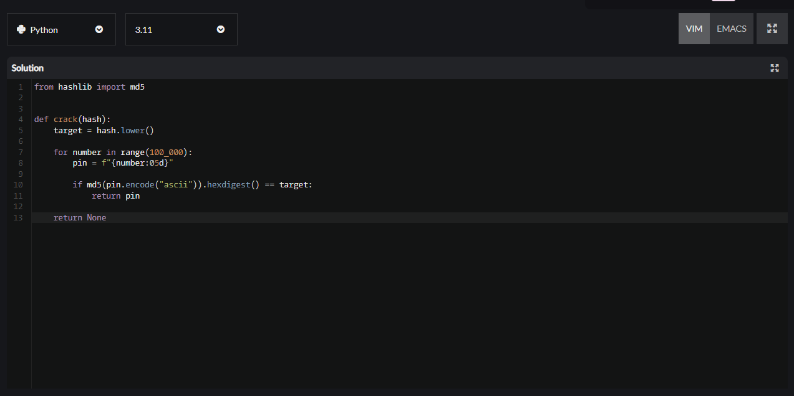

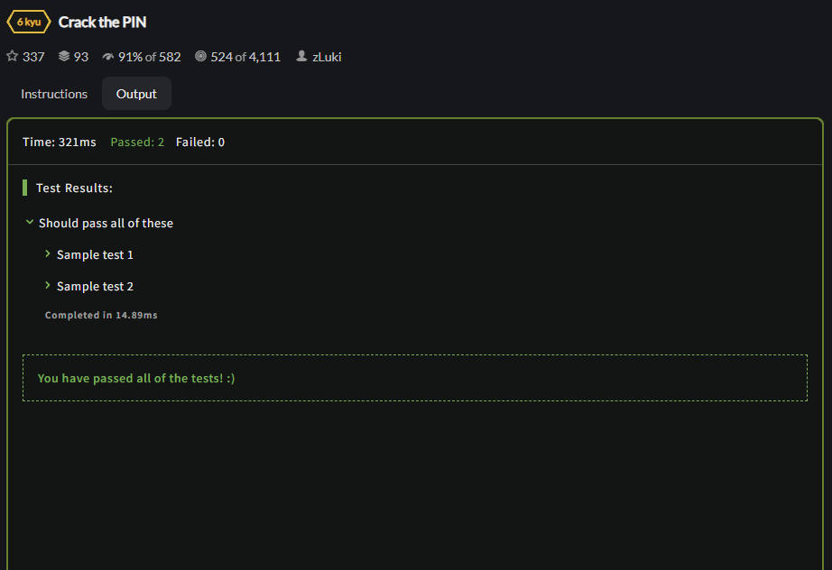

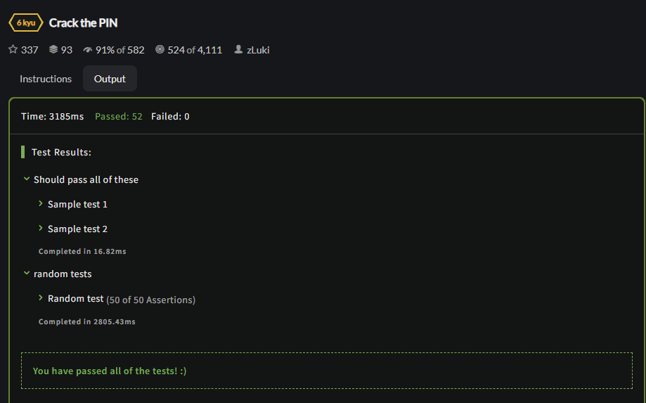

Код у `solution/codewars_solution.py` відповідає реалізації на скриншоті.
Результати прогону й контрольні суми зображень збережено в
[`platform_results.json`](docs/results/platform_results.json).

Для локальної перевірки обрано межі діапазону, приклади з провідними
нулями та кандидати з різних частин простору. Очікувана кількість спроб
дорівнює числовому значенню PIN плюс один.

| PIN | Кількість спроб | Що перевіряється |
|---|---:|---|
| `00000` | 1 | нижня межа та всі провідні нулі |
| `00001` | 2 | провідні нулі |
| `00123` | 124 | форматування до п’яти цифр |
| `01234` | 1 235 | один провідний нуль |
| `12345` | 12 346 | звичайний кандидат |
| `54321` | 54 322 | друга половина простору |
| `99999` | 100 000 | верхня межа включно |

Усі контрольні приклади пройдено. Додаткові 96 локальних тестів
перевіряють формат входу, межі пошуку, лічильники й узгодженість
збережених результатів із розрахунками. Незалежний генератор перевірив
відповідність повної таблиці всім 100 000 PIN; повторюваних MD5-хешів
у цій множині не виявлено. Це результат для дослідженого простору,
а не твердження про відсутність колізій MD5 загалом.

```bash
python -m pytest -q
```

---

## 6. Обчислювальні експерименти

Початкова серія 6.1–6.5: один потік CPU, три повтори, медіана та всі сирі тривалості;
Python вимірюється всередині процесу, без часу його запуску.
Seed `5005` фіксує вибір вхідних PIN. Параметри й машина наведені у
[`experiments.json`](docs/results/experiments.json), подробиці — у
[`methodology.md`](docs/methodology.md).

### 6.1 Довжина PIN

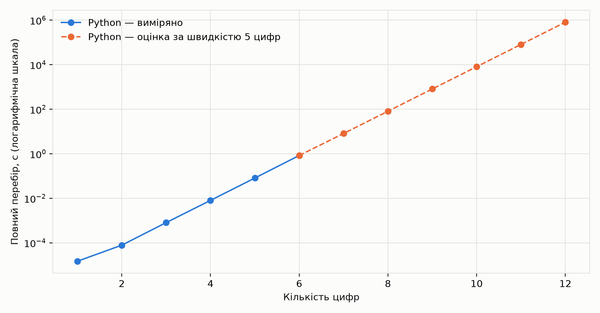

Повністю перевірено простори від однієї до шести цифр, включно з
мільйоном кандидатів. Результати стосуються цієї Python-реалізації та
цієї машини; вони не є універсальною оцінкою швидкості MD5.

| Цифри | Кандидати | Python, с |
|---|---:|---:|
| 1 | 10 | 0,000015 |
| 2 | 100 | 0,000078 |
| 3 | 1 000 | 0,000802 |
| 4 | 10 000 | 0,007996 |
| 5 | 100 000 | 0,080762 |
| 6 | 1 000 000 | 0,832031 |

Для 7–12 цифр використано модель `10ᵈ/r`, де `r` виміряно на
п’ятизначному просторі. На рисунку оцінки позначено пунктиром.
За цією моделлю повний перебір 8 цифр потребує приблизно 80,8 с,
10 цифр — 2,24 год, 12 цифр — 9,35 діб.
Це оцінки для локального послідовного циклу; ці простори не перебиралися.

### 6.2 Позиція PIN

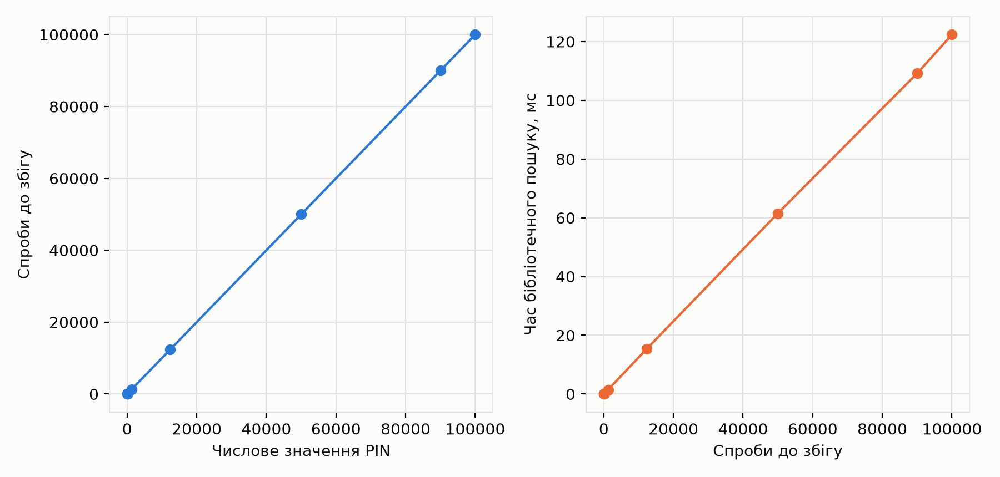

`00000` знаходиться з першої спроби, `99999` — зі стотисячної. Відмінність
не пояснюється «легким» чи «складним» MD5: результат визначає порядок
кандидатів. Тому замір одного раннього PIN не характеризує найгірший
випадок. Час на цьому рисунку виміряно для бібліотечного пошуку, який
додатково перевіряє вхід; він відрізняється від мінімального kata-циклу.

### 6.3 Швидкий хеш та вартість перевірки

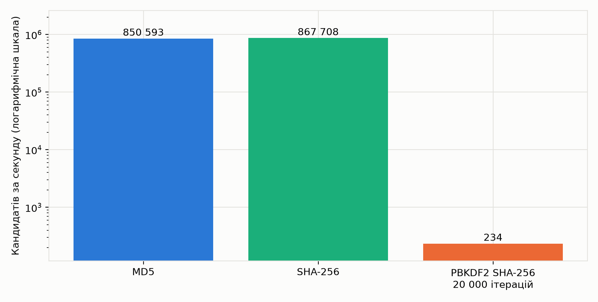

| Алгоритм | Кандидатів/с | Оцінка повного перебору 5 цифр |
|---|---:|---:|
| MD5 | 850593 | 0,118 с |
| SHA256 | 867708 | 0,115 с |
| PBKDF2 | 234 | 426,758 с |

Вихід SHA-256 довший за вихід MD5, але кандидатів усе одно 100 000.
У цьому прогоні швидкі хеші мають близьку пропускну здатність. PBKDF2
робить перевірку дорожчою приблизно у 3630 разів, але не
змінює простір PIN. Для нього виміряно 200 перевірок за повтор, а час
повного перебору є оцінкою. 20 000 ітерацій — навчальний параметр,
не рекомендація для реальної системи.

### 6.4 Попередня таблиця

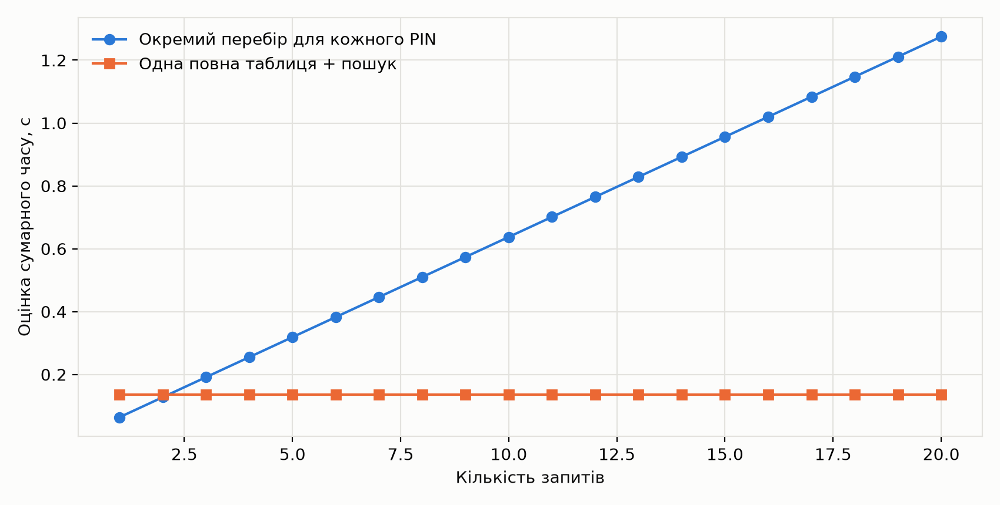

Побудовано словник `MD5(PIN) → PIN` для всього п’ятизначного простору.
Це повна таблиця прообразів, не rainbow table: тут немає ланцюжків
та функцій редукції.

| Показник | Результат |
|---|---:|
| Кількість елементів | 100 000 |
| Колізії в цьому просторі | 0 |
| Час побудови | 0,136 с |
| Обліковані Python-об’єкти | 15,02 МіБ |
| Розрахункова точка амортизації | 2,13 запиту |

Розмір визначено як суму `sys.getsizeof` словника, ключів і значень.
Він не враховує всі витрати алокатора й не дорівнює RSS процесу.
Точка амортизації отримана з часу побудови, середнього часу 20 окремих
переборів і пакетного часу пошуку 2 000 ключів. Це оцінка для повторних
запитів до того самого несоленого простору; значення не універсальне.

Таблиця не додає нових знань про MD5. Вона один раз виконує перебір,
а потім використовує результат багаторазово, обмінюючи пам’ять на час.

### 6.5 Сіль та дифузія

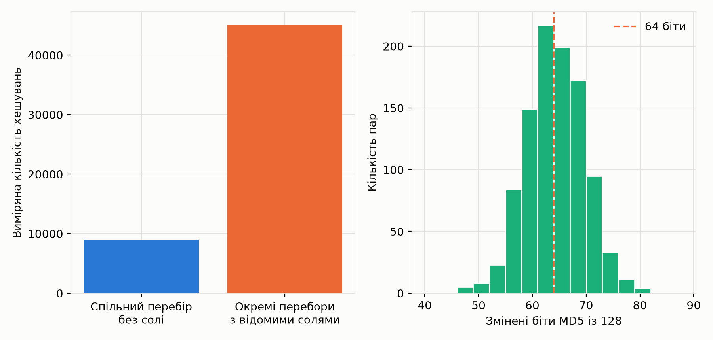

Для десяти чотиризначних PIN `0000, 1000, …, 9000` спільний несолений
перебір відновив усі хеші за 9 001 обчислення. Коли кожен запис
має свою відому сіль, окремі перебори потребували 45 010
обчислень. Це точні лічильники для обраних PIN, не середнє по користувачах.
Найгірший випадок за повного покриття простору: `10⁴` хешувань без солі
проти `10 · 10⁴` за десяти різних солей.

У моделі обчислюється `MD5(salt || ASCII(PIN))`. Сіль не є секретом,
не збільшує кількість варіантів одного PIN і не зупиняє перебір одного
облікового запису. Вона розділяє обчислення між записами й заважає
застосувати готову таблицю без солі. Така конструкція потрібна тут
для демонстрації; вона не є схемою зберігання реальних паролів.

Додатково порівняно 1 000 пар сусідніх PIN. У середньому змінилося
63,84 із 128 біт MD5. Це емпірична дифузія на цій вибірці,
а не доказ криптографічної стійкості. PIN усе одно відновлюється повним
перебором: нелокальна зміна виходу не робить малий вхідний простір великим.
Сусідні десяткові рядки можуть відрізнятися кількома бітами входу, тому
цей дослід не є перевіркою строгого лавинного критерію.

---

### 6.6 Умови апаратних вимірювань

Досліди виконано на комп’ютері з процесором Intel
і відеокартою серії RTX, під Windows 11 із Python 3.12.14.
У кожному повному прогоні цільовим був останній кандидат заданого порядку,
щоб вимірювати найгірший випадок; знайдений рядок повторно перевірявся.

Послідовна й багатопроцесна CPU-серії разом тривали 1 190,1 с.
Виконано 31 повну послідовну конфігурацію та 5 конфігурацій паралелізму;
у вимірюваних прогонах зафіксовано 2 067 440 098 MD5-перевірок.
Частоти не фіксувалися, фонове навантаження Windows не ізолювалося.

### 6.7 Короткі паролі: цифри, літери та регістр

Досліджено шість алфавітів: `0–9` (10), `a–z` (26), `A–Z` (26), `a–z` + цифри (36), `a–zA–Z` (52), `a–zA–Z0–9` (62). Довжина фіксована; коротші слова до простору довшого не додаються. Усі символи — ASCII, одна позиція дорівнює одному байту.

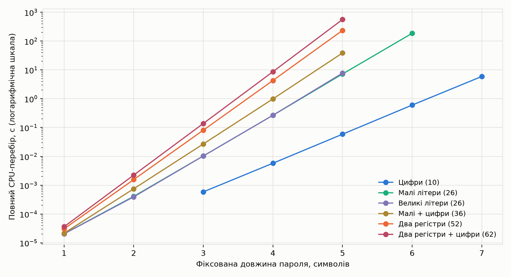

| Алфавіт / довжина | Кандидати | CPU, с | Повтори |
|---|---:|---:|---:|
| Цифри (10), 5 | 100 000 | 0,058805 | 3 |
| Цифри (10), 7 | 10 000 000 | 5,923203 | 3 |
| Малі літери (26), 5 | 11 881 376 | 7,222225 | 3 |
| Великі літери (26), 5 | 11 881 376 | 7,753391 | 3 |
| Малі + цифри (36), 5 | 60 466 176 | 38,707454 | 1 |
| Малі літери (26), 6 | 308 915 776 | 186,253088 | 1 |
| Два регістри (52), 5 | 380 204 032 | 235,203750 | 1 |
| Два регістри + цифри (62), 5 | 916 132 832 | 561,435762 | 1 |

Час — медіана повторів. Для найдовших CPU-прогонів виконано один повний повтор через часовий бюджет; це одиничне спостереження, без оцінки розкиду. Повні короткі прогони мають три повтори. За однакової довжини розмір простору визначає кількість роботи: для п’яти символів 26 символів дають 11 881 376 кандидатів, 52 — 380 204 032, 62 — 916 132 832. Зміна регістру без розширення 26-символьного алфавіту не збільшує його потужність.

Двійкове порівняння `digest()` у цьому стенді відрізняється від `hexdigest()` у рішенні Codewars. Тому нові цифрові часи та початкові вимірювання з розділу 6.1 належать різним реалізаціям.

### 6.8 Паралельний CPU-перебір

Для 1, 2, 4, 8 і 16 процесів виконано той самий простір 62⁴ = 14 776 336 кандидатів. 62 завдання розподіляються за першим символом; кожне перевіряє всі суфікси. Пул створюється й прогрівається до таймера. Передавання завдань і збирання результатів входять у час.

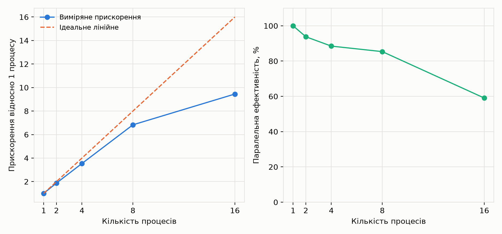

| Процеси | Медіана, с | Прискорення | Ефективність |
|---:|---:|---:|---:|
| 1 | 9,428974 | 1,00× | 100,0 % |
| 2 | 5,026595 | 1,88× | 93,8 % |
| 4 | 2,664007 | 3,54× | 88,5 % |
| 8 | 1,380725 | 6,83× | 85,4 % |
| 16 | 0,998033 | 9,45× | 59,0 % |

Для 16 процесів прискорення становило 9,45×, ефективність — 59,0 %. Прискорення визначено як T₁/Tₚ, ефективність — (T₁/Tₚ)/p. Вони не є лінійними через керування процесами, планувальник, неоднорідні ядра й інше навантаження. Дослід не вимірює окремо внесок кожної причини.

### 6.9 Паралельна перевірка кандидатів на GPU

GPU-ядро реалізує 64 кроки одноблокового MD5 за RFC 1321. Перед вимірюваннями 1715 хешів для шести алфавітів і довжин 1, 2, 3, 4, 5, 6, 8 звірено з CPU `hashlib`; усі збіглися. Включено перший і останній кандидати, середину та псевдовипадкові індекси із зерном 5009. Результати збережено разом з індексами та хешами.

Один GPU-потік обробляє один індекс слова: переводить його в систему числення з основою розміру алфавіту, додає MD5-доповнення, хешує і порівнює всі 128 біт. Одна група має 256 потоків; пакет — до 33 554 432 кандидатів. Потоки поза кінцем простору повертаються без хешування. Збіг записується атомарно, а знайдений рядок повторно перевіряється CPU. Лічильник індексу 64-бітний, тому простір понад 2³² не обрізається.

Компіляцію кожного спеціалізованого ядра та окреме прогрівання вилучено з часових показників. Час усього запуску охоплює створення буферів, передавання цілі, запуск пакетів, синхронізацію та отримання результату. Час ядер — сума інтервалів OpenCL `event.profile.end − start`. Це різні показники, їх наведено окремо. GPU-тести запускалися після CPU-серії.

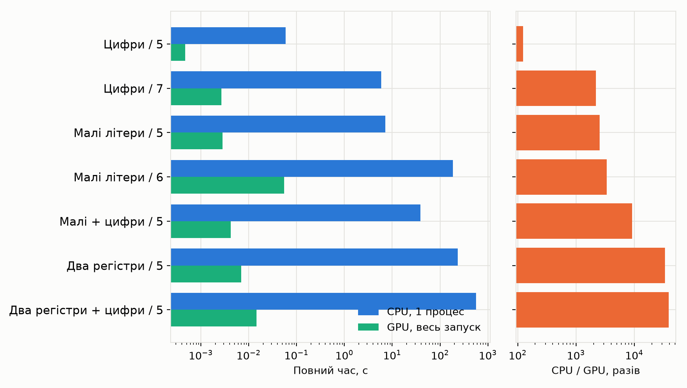

| Алфавіт / довжина | CPU, с | GPU весь запуск, с | Прискорення |
|---|---:|---:|---:|
| Цифри (10), 5 | 0,058805 | 0,000472 | 124,7× |
| Цифри (10), 7 | 5,923203 | 0,002699 | 2 194,5× |
| Малі літери (26), 5 | 7,222225 | 0,002842 | 2 541,6× |
| Малі літери (26), 6 | 186,253088 | 0,054932 | 3 390,6× |
| Малі + цифри (36), 5 | 38,707454 | 0,004238 | 9 134,1× |
| Два регістри (52), 5 | 235,203750 | 0,007002 | 33 592,4× |
| Два регістри + цифри (62), 5 | 561,435762 | 0,014489 | 38 748,3× |

Порівняння показує прискорення конкретного стенда: CPU виконує Python-цикл, GPU — спеціалізоване скомпільоване OpenCL-ядро. Відмінність містить і апаратний паралелізм, і різні накладні витрати реалізацій; це не чисте порівняння CPU/GPU або мов програмування.

### 6.10 GPU: накладні витрати та найбільший простір

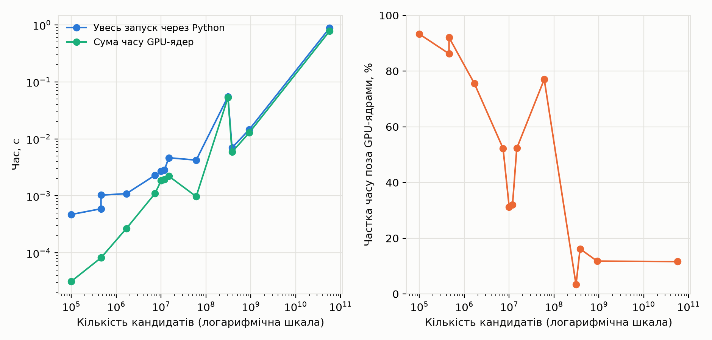

| Алфавіт / довжина | Кандидати | GPU весь запуск, с | GPU ядра, с |
|---|---:|---:|---:|
| Цифри (10), 7 | 10 000 000 | 0,002699 | 0,001855 |
| Малі літери (26), 6 | 308 915 776 | 0,054932 | 0,053094 |
| Два регістри (52), 5 | 380 204 032 | 0,007002 | 0,005870 |
| Два регістри + цифри (62), 5 | 916 132 832 | 0,014489 | 0,012784 |
| Два регістри + цифри (62), 6 | 56 800 235 584 | 0,880358 | 0,778074 |

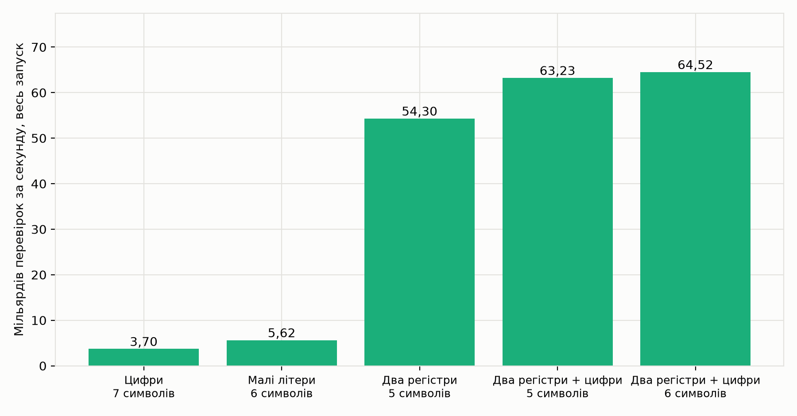

Найбільший повністю перевірений GPU-простір — 56 800 235 584 кандидатів (62 символів, довжина 6). Медіана повного запуску — 0,880358 с, пропускна здатність — 64,52 млрд/с. Це результат реального повного перебору, а не екстраполяція. На малому просторі створення буферів і запуск займають помітну частку часу; на великому домінує обчислення. Зростання довжини не гарантує сталої GPU-швидкості: змінюються перетворення індексів та код спеціалізованого ядра.

GPU-серія містить 13 повних конфігурацій та 175 537 851 888 MD5-перевірок у вимірюваних повторах. Прогрівання до цієї кількості не включено. Сирі дані: `hardware.json`, `gpu.json`; протокол: `docs/hardware_methodology.md`. Часткові прогони, якщо вони є, залишаються в JSON із `complete: false` та не включаються до цих таблиць.

### 6.11 Розрахункова межа для довших паролів

Для ілюстрації використано виміряну швидкість найбільшого GPU-простору 64,52 млрд/с. За умовної незмінної швидкості повний час 62-символьного алфавіту дорівнює 62ᵈ/r, середній за рівномірного вибору — (62ᵈ+1)/(2r). Наведені далі простори не перебиралися. Це екстраполяція, яка не враховує зміну GPU-коду, частот, накладних витрат і довжини. Реалізація стенда підтримує лише довжини до 8; значення для 9–10 символів є суто математичним продовженням моделі.

| Довжина | Кандидати | Оцінка повного часу, год |
|---:|---:|---:|
| 7 | 3 521 614 606 208 | 0,015 |
| 8 | 218 340 105 584 896 | 0,940 |
| 9 | 13 537 086 546 263 552 | 58,282 |
| 10 | 839 299 365 868 340 224 | 3 613,463 |

Так видно, що межа практичності зміщується разом із ресурсом атаки. Шість випадкових буквено-цифрових символів уже створюють десятки мільярдів варіантів, але цей простір ще доступний сучасному GPU для швидкого MD5. Цей висновок стосується локального відомого хешу й цього стенда, а не будь-якого сервісу або повільної функції зберігання паролів.

---

## 7. Криптоаналіз і межі практичності

### 7.1 Алфавіт та бюджет атаки

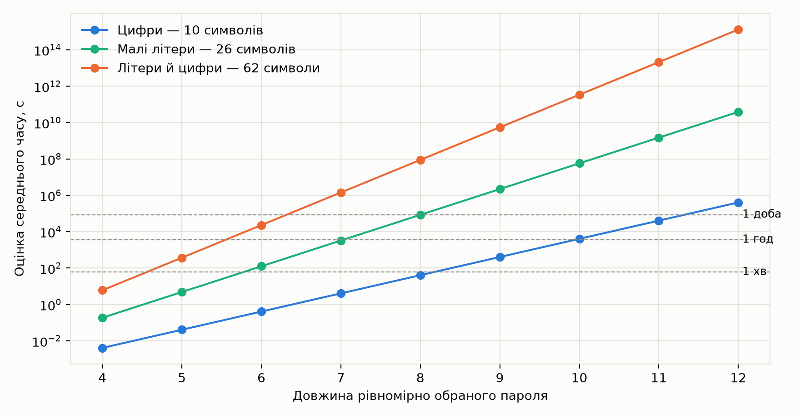

Для алфавіту розміру `a` простір містить `aᵈ` рядків. На графіку
порівняно `a = 10`, `26` і `62` за однакової виміряної швидкості.
Це модель, а не вимірювання хешування буквено-цифрових паролів.
Припущення: незалежний рівномірний вибір кожного символу, однакова
вартість перевірки, відсутність відомих правил формування пароля.

Умову для допустимого середнього часу атаки `B` наведено
у [формулі (4)](#formula-4):

<a id="formula-4"></a>

$$
\frac{a^d+1}{2r} > B \qquad\text{(4)}
$$

Мінімальна довжина — найменше ціле `d`, що задовольняє
[нерівність (4)](#formula-4).
Саме вона відповідає на запитання лабораторної про межу перебору.
Єдиної довжини, після якої перебір «втрачає сенс», немає: результат
змінюється разом із `a`, `r`, бюджетом і розподілом паролів.

### 7.2 Розподіл PIN та порядок перевірки

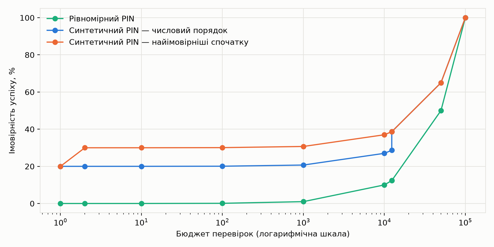

Довжина — лише верхня межа невизначеності. Для рівномірного PIN шанс
успіху після `q` різних перевірок дорівнює `q/N`. Для нерівномірного
розподілу він дорівнює сумі ймовірностей перевірених PIN.

Побудовано синтетичну модель: `P(00000) = 0,2`, `P(12345) = 0,1`,
інші 99 998 PIN рівномірно ділять решту `0,7`. Ці значення задані для
контрольованого досліду; даних про поведінку реальних користувачів немає.

Дві перевірки найімовірніших PIN дають шанс 30 %. У рівномірній
моделі дві перевірки дають лише 0,002 %. Кількість можливих рядків
в обох випадках однакова. Ентропія синтетичного розподілу — `12,78` біта,
а середня кількість спроб за оптимального порядку — `35 001,45`.
Ентропія та очікувана кількість спроб — різні характеристики:
підставляти `2ᴴ` у формулу повного перебору нерівномірного PIN некоректно.

### 7.3 Офлайнова та онлайнова атаки

У kata хеш уже відомий: кожну перевірку можна виконувати локально.
Обмеження кількості запитів на сайті на такий перебір не впливає.
За онлайнової атаки кожний кандидат надсилається серверу, тому
ліміти спроб, затримки та блокування змінюють її можливий бюджет.

Наприклад, у заданій моделі п’яти спроб за секунду повний
п’ятизначний перебір потребує `20 000 с`, або `5,56 год`, замість
частки секунди локального MD5. Це арифметична ілюстрація заданого
ліміту; запити до реальних систем не здійснювалися.

Криптографічна сіль, дорогий password KDF, достатня випадковість
секрету й обмеження онлайнових спроб вирішують різні задачі. Для
сучасного хешування паролів RFC 9106 описує Argon2, де вартість
обчислення включає пам’ять. Argon2 у цьому стенді не реалізовано,
тому його швидкість не оцінюється.

### 7.4 Межі результатів

Вимірювання характеризують зафіксований прогін і конкретні реалізації.
Початкова цифрова серія охоплює 1–6 цифр, додаткова CPU-серія — до семи
цифр та літерні простори. Повні GPU-прогони відокремлено від модельних
оцінок. Час платформи Codewars і час локального стенда також описують
різні способи перевірки.

Три повтори дають уявлення про локальний розкид, але не про всі режими
роботи обладнання. Для найдовших CPU-конфігурацій виконано один повтор.
Компіляцію та прогрівання GPU вилучено з вимірювань, тому наведено час
прогрітого стенда. У коротких циклах вплив запуску й таймера має більшу
відносну вагу.

Відсутність колізій серед 100 000 PIN стосується цієї множини. Відомі
проблеми MD5 зі стійкістю до колізій описано в RFC 6151; виконаний перебір
не використовує колізійну атаку. Сіль і параметри PBKDF2 тут навчальні,
а розподіл PIN синтетичний. Їх використано для контрольованих дослідів,
без побудови реальної системи автентифікації.

---

## 8. Висновки

Реалізовано повний перебір п’ятизначного цифрового PIN за відомим MD5-хешем мовою Python. Алгоритм зберігає провідні нулі та включає обидві межі діапазону. Проходження перевірок Codewars і локальні контрольні приклади підтвердили коректність розв’язку.

Повний перебір 100 000 варіантів у початковій реалізації тривав приблизно 0,081 с. Додавання цифри збільшує простір у десять разів, а положення шуканого PIN визначає момент зупинки. Тому час одного швидко знайденого прикладу не характеризує найгірший випадок. Довжина 128-бітного хешу також не додає варіантів до п’ятизначного PIN.

Реальні прогони підтвердили вплив алфавіту: 916 132 832 п’ятисимвольні комбінації літер обох регістрів і цифр послідовно перевірено за 561,436 с. Для простору 62⁴ шістнадцять процесів дали прискорення у 9,45 раза. Графічне виконання повністю перевірило 62⁶ = 56 800 235 584 кандидатів за медіанний повний час 0,880358 с. Прискорення характеризує конкретні реалізації з різними способами виконання та накладними витратами.

Попередня таблиця дозволила повторно використовувати результати, обмінюючи пам’ять на час. Різні солі розділили обчислення між записами, але не збільшили простір одного PIN. SHA-256 мав близьку до MD5 швидкість перевірки, тоді як PBKDF2 суттєво збільшив її вартість. Значна дифузія MD5 не завадила перебору малого набору входів.

Межа практичності залежить від довжини, алфавіту, вартості перевірки, доступних обчислень і розподілу секретів. Екстраполяція показала швидке зростання часу для довших паролів, а синтетичний нерівномірний розподіл — перевагу ранньої перевірки ймовірних значень. Отже, лише довжина PIN або хешу не характеризує захист.

---

## 9. Відтворення результатів

```bash
# Контрольні приклади без зовнішніх залежностей
python run.py selftest
```

```bash
# Повний набір тестів і початкові сім графіків
python -m pip install -r requirements.txt
python -m pytest -q
python experiments/run_experiments.py
```

Програма записує всі повтори й параметри в `docs/results/experiments.json`,
оновлює `summary.md` та рисунки. Часові значення після повторного запуску
зміняться; дані для README наведені за збереженим прогоном. До публікації
нових часових тверджень потрібно узгодити їх із новими первинними даними.

```bash
# Апаратні CPU-досліди: не більше 25 хвилин
# У Windows спочатку оновити метадані обладнання
powershell -File experiments/collect_machine.ps1
python experiments/hardware_benchmark.py --max-seconds 1500

# GPU потребує драйвера з OpenCL; необов’язкові залежності
python -m pip install -r requirements-gpu.txt
python experiments/gpu_benchmark.py --validate-only
python experiments/gpu_benchmark.py
python experiments/render_hardware.py
```

GPU-серія без явного аргументу має бюджет 600 секунд. Для спільного обмеження CPU/GPU
можна задати GPU `--wait-for-cpu --deadline-utc` з абсолютним UTC-часом завершення.
Перед запуском CPU метадані обладнання можна зберегти у `docs/results/machine.json`;
GPU-скрипт сам зчитує дані пристрою. CPU-програма читає наявний файл метаданих,
а версію Python, платформу та кількість логічних CPU визначає при кожному запуску.
Графіки будуються після завершення вимірювань.

Векторні PDF графіків розміщені в `docs/figures/pdf/`, PNG поруч не
мають внутрішніх заголовків і призначені для зовнішніх підписів у звіті.

---

## 10. Список використаних джерел

1. Codewars. Crack the PIN [Електронний ресурс]. – Режим доступу: https://www.codewars.com/kata/5efae11e2d12df00331f91a6

2. Rivest R. The MD5 Message-Digest Algorithm. – RFC 1321, 1992. – Режим доступу: https://www.rfc-editor.org/rfc/rfc1321

3. Turner S., Chen L. Updated Security Considerations for MD5 and HMAC-MD5. – RFC 6151, 2011. – Режим доступу: https://www.rfc-editor.org/rfc/rfc6151

4. Python. hashlib — Secure hashes and message digests [Електронний ресурс]. – Режим доступу: https://docs.python.org/3/library/hashlib.html

5. Khronos Group. OpenCL API Specification [Електронний ресурс]. – Режим доступу: https://registry.khronos.org/OpenCL/specs/3.0-unified/html/OpenCL_API.html

6. PyOpenCL. Command queues and events [Електронний ресурс]. – Режим доступу: https://documen.tician.de/pyopencl/runtime_queue.html

7. Biryukov A., Dinu D., Khovratovich D., Josefsson S. Argon2 Memory-Hard Function for Password Hashing and Proof-of-Work Applications. – RFC 9106, 2021. – Режим доступу: https://www.rfc-editor.org/rfc/rfc9106

8. Вихідний код та результати роботи [Електронний ресурс]. – Режим доступу: https://github.com/RE22GDV/LR5-CrackPIN

---

<p align="center"><sub>Лабораторна робота №5 · Захист даних · 2026</sub></p>
